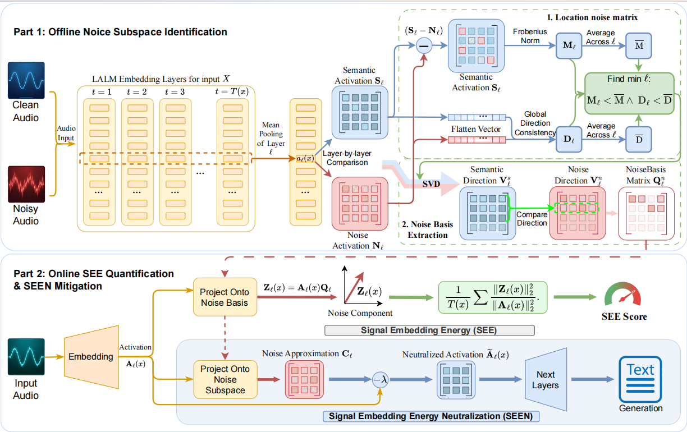

# SEE: Signal Embedding Energy for Quantifying Noise Interference in Large Audio Language Models

## Abstract
Large Audio Language Models (LALMs) have been widely applied in real-time scenarios, such as in-car assistants and online meeting comprehension. In practice, audio inputs are often corrupted by device and environmental noise, leading to performance degradation. However, existing LALM studies on noise lack quantitative analysis and rely mainly on intuition and empirical observation, thus failing to understand practical robustness. To address this issue, we introduce **S**ignal **E**mbedding **E**nergy (**SEE**), a method for quantifying the impact of noise intensity on LALM inputs, enabling the differentiation of LALM robustness in real-world deployments. SEE introduces a perspective based on structured activation subspaces derived from the model's internal representations, which more accurately captures its perception of noise than raw audio features. Across experiments, SEE exhibits a strong correlation with LALM performance, achieving a correlation of 0.98. Surprisingly, traditional audio denoising methods are only marginally effective for LALMs, and, in some cases, even increase SEE and impair performance.This suggests a mismatch between speech-centric denoising objectives and the noise sensitivity of modern LALMs.Therefore, we propose a mitigation strategy derived from SEE to denoise LALM inputs, outperforming existing denoising methods. This paper introduces a novel metric for noise quantification in LALMs, providing guidance for robustness improvements in real-world deployments. 

## Prepare 
1.Environment Setup
The experiment environment is managed using **Conda**. Follow the steps below to create and configure the environment:

```bash
# 1. Create Conda environment (name: SEE)
conda create -n SEE python=3.12 -y
conda activate SEE
# 2. Import dependencies from environment.yaml
conda env update -f environment.yaml
```
2. Datasets
Datasets are divided into four categories:speech, sound, music and librispeech. All datasets should be placed under the datasets/ directory.
- [MMAU](https://drive.google.com/file/d/1fERNIyTa0HWry6iIG1X-1ACPlUlhlRWA/view?pli=1)
- [LibriSpeech](https://huggingface.co/datasets/openslr/librispeech_asr)
we can use the following script to acquire noise datasets:
```bash
bash create_data.sh
```
3. Models
Qwen,MiniCPM,Stepaudio models can be downloaded from huggingface and placed in the models in their directory.   
- [Qwen2.5-Omni](https://huggingface.co/Qwen/Qwen2.5-Omni-7B)
- [MiniCPM-o-2_6](https://huggingface.co/openbmb/MiniCPM-o-2_6)
- [Stepaudio2-mini](https://huggingface.co/stepfun-ai/Step-Audio-2-mini)

## Quick Start
To quickly run the SEE evaluation and mitigation experiments, follow these steps:
```bash
cd ./Qwen
bash getacc.sh
```